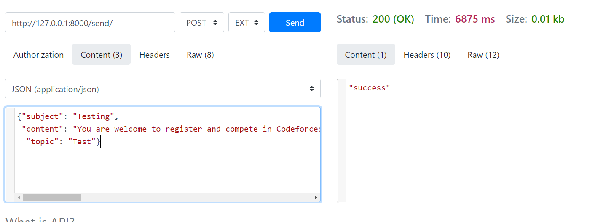

The Assignment is based on APIs and the database used is Django's default database i.e. SQLite.

There are 3 endpoint for the API:

# 1. /register/
* This endpoint works on POST Method.
* POST takes 2 arguments: email, topic.
* email is the email-id of that user and topic is the topic that user wants to subsribe.
* The topic entered by user must be in the database and if it not, an error will be popped up.

# 2. /content/
* This endpoint works on POST Method.
* POST takes one argument: topic.
* topic argument is for creating a row for that topic in the database.

# 3. /send/
* This endpoint works on POST Method.
* POST takes three arguments: subject, content, topic.
* subject is the mailing subject for that mail.
* content is the body for that mail.
* topic is the name of topic to that users who have subscribed to that mail can recieve email.

# Steps to run
* Clone the repo into your local system.
* Navigate to curelink folder and install the required packages by running `pip install -r requirements.txt`
* Now start the server by running `python manage.py runserver`
* The app will be running on http://127.0.0.1:8000/
* To test the app, use any REST API service like Postman or Reqbin.